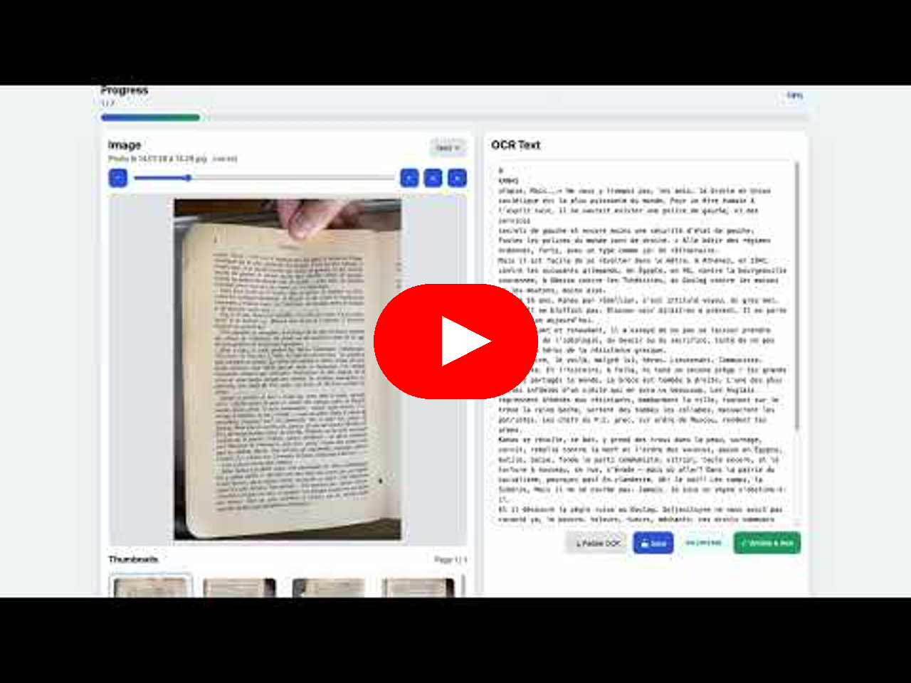
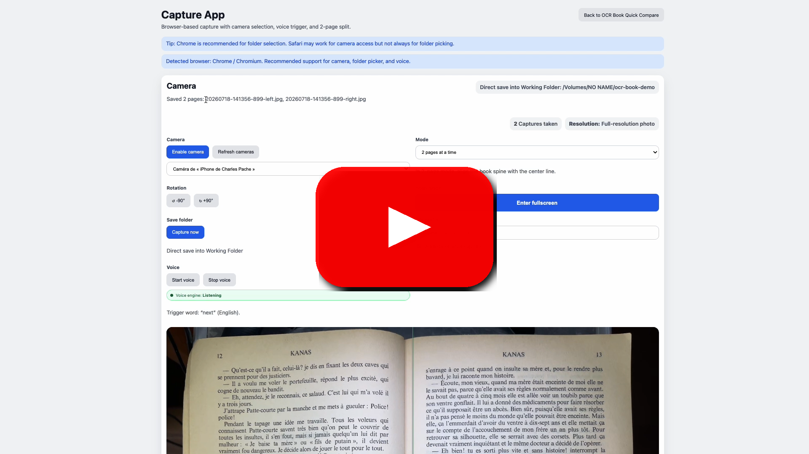

<div align="center">

# OCR Book Quick Compare v4

<p>
  <a href="https://youtu.be/8RaAw9v7SG8">
    
  </a>
</p>

<p>
  <a href="https://youtu.be/8RaAw9v7SG8"><strong>▶ Watch the 8-minutes introduction video on YouTube</strong></a>
</p>

<p>
  <a href="https://youtu.be/DMKcqhTXROw">
    
  </a>
</p>

<p>
  <a href="https://youtu.be/DMKcqhTXROw"><strong>▶ Watch the Capture Companion App demo on YouTube</strong></a>
</p>

<p>
  Quick demo of the browser-based companion capture app: live camera preview, one-page/two-page capture, rotation, fullscreen scan mode, and instant save to your OCR working folder.
</p>

<p>
  
  
  
  
</p>

Small local web app to compare scanned book page images with their OCR text, edit the text, and validate each page, now paired with a companion capture app for live page photography.

</div>

## v4 Features (New!)

- **Validation history**: Undo the last validated page to move it back to the queue
- **Inline rename**: Click the current filename to rename `.jpg/.jpeg` and paired `.txt`
- **Image rotation**: Rotate images ±90° for better orientation viewing
- **Pagination of thumbnails**: Browse large thumbnail lists with pagination (20 per page)
- **Auto-import upload flow**: Drag/drop or file selection starts import immediately
- **Auto `.txt` pairing on upload**: Imported images get their `.txt` sibling instantly
- **Auto-OCR on import**: Optional OCR processing while importing images
- **Multilingual UI**: Language switcher (FR / EN / IT / DE)
- **Separate OCR language selection**: OCR language can differ from UI language
- **Downsize validated images**: Optional post-validation compression with target size slider (default 300 KB)
- **Global text export**: Download all OCR texts as a ZIP file with organized folders
- **Advanced split view sync**: Horizontal scroll synchronization between image and text panels
- **Capture companion app**: Open a browser-based capture tool from the top toolbar (camera live view, voice trigger, rotation, 1-page/2-page modes)
- **Shared Working Folder**: Use one common folder between OCR app and capture app so newly captured images appear directly in OCR review

## Core Features (v3 & earlier)

- create missing `.txt` files for each `.jpg` / `.jpeg` image without overwriting existing text files
- process pages in chronological image order (oldest file timestamp first)
- display the current page image next to its editable text
- save text corrections
- autosave text edits while typing
- show a clear unsaved / autosaved status indicator
- validate the current page and move the image/text pair to `images/check-done/`
- automatically continue with the next available page
- `Validate + next` action to save and validate in one step
- confirmation before validate-only actions
- manual previous / next navigation between ready page pairs
- thumbnail gallery for the remaining ready pages (paginated)
- advanced filtering and sorting of ready pages
- global progress counters and progress bar
- image zoom controls
- image rotation controls
- keyboard shortcuts for the main actions
- drag-and-drop or click-to-upload image import
- local OCR action using PaddleOCR


## Technology choice

This implementation uses **Python + Flask**.

Why it fits this project well:

- quick to build and easy to run locally
- straightforward filesystem handling
- very small stack for a workflow-oriented internal tool
- easy to test and extend
- lighter than a full frontend framework for this use case

## Requirements

- Python 3.9+ (3.11+ recommended)
- OCR dependencies from `requirements.txt` (`paddleocr` + `paddlepaddle`)

## Project layout

```text
[PROJECT DIR]/
├── app.py
├── requirements.txt
├── README.md
├── capture-app/
│   ├── main.py
│   ├── capture_core.py
│   ├── voice_trigger.py
│   ├── download_vosk_model.py
│   ├── requirements.txt
│   └── tests/
│       └── test_capture_core.py
├── static/
│   ├── app.js
│   └── styles.css
├── templates/
│   └── index.html
├── tests/
│   └── test_app.py
└── images/
    └── check-done/
```

## Setup

```bash
cd "[PROJECT DIR]"
python3 -m venv .venv
source .venv/bin/activate
pip install -r requirements.txt
```

## One-command bootstrap (recommended)

Use the bootstrap script to configure both virtualenvs, install dependencies, download the Vosk model, and run basic checks.

```bash
cd "[PROJECT DIR]"
./bootstrap.sh
```

Useful options:

```bash
cd "[PROJECT DIR]"
./bootstrap.sh --help
./bootstrap.sh --skip-model
./bootstrap.sh --dry-run
```

### Companion app setup (separate venv recommended)

`paddleocr` and camera/audio packages have conflicting OpenCV constraints on some macOS setups.
Use a dedicated virtualenv for `capture-app`:

```bash
cd "[PROJECT DIR]/capture-app"
python3 -m venv .venv
source .venv/bin/activate
pip install -r requirements.txt
```

If you already ran `./bootstrap.sh`, this step is already done.

## OCR engine

This project now uses **PaddleOCR only**.

Install dependencies with:

```bash
pip install -r requirements.txt
```

## Run locally with OCR Language

```bash
cd "[PROJECT DIR]"
source .venv/bin/activate
python3 app.py
```

## Démarrage quotidien

Une fois `./bootstrap.sh` exécuté avec succès une première fois, le flux quotidien recommandé est le suivant.

### 1) Redémarrer l'app web OCR

Utilise `restart.sh` pour relancer proprement l'application principale Flask :

```bash
cd "[PROJECT DIR]"
./restart.sh
```

Notes :
- le script utilise automatiquement le virtualenv racine `./.venv`
- il arrête un ancien serveur du projet s'il écoute déjà sur le même port
- par défaut, le port utilisé est `5001`

Ensuite, ouvre dans le navigateur :

```text
http://127.0.0.1:5001
```

### 2) Ouvrir la companion capture app

Depuis l'interface de `OCR Book Quick Compare`, clique sur **Open Capture App** dans la barre du haut.

La companion app s'ouvre dans un **nouvel onglet du navigateur**.

Elle utilise les API web du navigateur pour :
- détecter les caméras disponibles
- afficher le flux live
- capturer 1 page ou 2 pages
- séparer automatiquement gauche/droite en mode 2 pages
- écouter le mot déclencheur `next` si le navigateur supporte la reconnaissance vocale

### 3) Alternative: lancer la capture app manuellement

La version recommandée est désormais celle dans le navigateur.

Le prototype desktop dans `capture-app/` peut rester utile pour des essais techniques, mais sur certaines machines macOS il peut planter à cause de la pile GUI native Python/Tk.

Si tu veux quand même tester ce prototype desktop manuellement :

```bash
cd "[PROJECT DIR]"
source capture-app/.venv/bin/activate
python3 capture-app/main.py
```

### 4) Quand relancer `bootstrap.sh` ?

Tu n'as normalement pas besoin de relancer `bootstrap.sh` chaque jour.
Relance-le seulement si par exemple :

- tu recrées les virtualenvs
- tu modifies les dépendances Python
- tu veux retélécharger/configurer le modèle vocal Vosk

```bash
cd "[PROJECT DIR]"
./bootstrap.sh
```

## Restart the app

If the app is already running, stop the current Flask process first, then start it again.

```bash
# In the terminal where the app is running:
Ctrl+C
```

Then restart with either of these commands:

```bash
# Preferred when the venv is already activated
flask --app app run --debug

# Or, if you want to be explicit
.venv/bin/flask --app app run --debug
```

If port `5000` is already in use on macOS, start on another port:

```bash
.venv/bin/flask --app app run --debug --port 5001
```

Or with environment options:

```bash
# Set OCR language (optional): fr, en, it, de
OCR_LANG="fr" python3 app.py

# Enable auto-OCR on import
AUTO_OCR="1" python3 app.py

# Combine both
AUTO_OCR="1" OCR_LANG="fr" python3 app.py
```

Then open: `http://127.0.0.1:5000` (or `:5001` if you started on port 5001)

## Usage flow

1. Add `.jpg` or `.jpeg` files to `images/`, or import them from the web UI
2. Upload via UI (drag/drop or click) to auto-import files and auto-create paired `.txt`
3. Click **Créer les .txt manquants** when images were copied directly via Finder
4. Pick UI language in the top switcher and OCR language in the top OCR selector if needed
5. Review the oldest ready page first
6. (Optional) Click the current filename under **Image** to rename both image and text pair
7. Run OCR, edit the text on the right, then save
8. (Optional) Enable **Downsize validated images** and set a target size (default 300 KB)
9. Click **Validate + next** to save, validate, and move to the next page
10. If downsize is ON, the image is compressed before it is moved to `images/check-done/`
11. Use thumbnails/filters to jump to another page
12. Continue until no page is left in `images/`

## Keyboard shortcuts

- `Cmd/Ctrl + S`: save the current text
- `Alt + V`: save, validate, and go to the next page
- `Alt + Shift + V`: validate only
- `Alt + Left`: go to the previous ready page
- `Alt + Right`: go to the next ready page
- `Alt + C`: create missing `.txt` files
- **Rotation** & **Zoom**: Use the UI buttons (keyboard shortcuts planned for future versions)

## Text Editing & Spell Checking

### Install LanguageTool for French Spell & Grammar Checking

The text editor uses **LanguageTool** extension for advanced French (and multilingual) spell checking and grammar correction.

**Why LanguageTool?**
- ✓ Excellent French spelling & grammar detection
- ✓ Context-aware suggestions
- ✓ Works offline (after first setup)
- ✓ Personal dictionary (no macOS cache issues)
- ✓ Supports 30+ languages
- ✓ Open source and free

**Installation:**

1. Open Chrome and go to [LanguageTool on Chrome Web Store](https://chrome.google.com/webstore)
2. Search for **"LanguageTool"** (by LanguageTool GmbH)
3. Click **"Add to Chrome"** and confirm permissions
4. The extension will appear in your Chrome toolbar

**Usage:**
- In any text field (including this app), red underlines appear for spelling errors
- Blue underlines appear for grammar suggestions
- Hover or click to see corrections and suggestions
- Right-click and select "Ignore" to skip a word, or "Add to dictionary" to learn it permanently

**Configure language:**
- Click the LanguageTool icon in the toolbar → Settings → Language
- Select **"Français"** (or your preferred language)
- Optionally enable grammar checking (may slow down slightly)

**Remove learned words:**
- LanguageTool stores its personal dictionary locally in your browser profile
- If you accidentally added a word: right-click it → "Remove from dictionary"
- To clear all custom words: LanguageTool Settings → Dictionary → "Clear"

## OCR Setup & Language Configuration

The **Paddle OCR** button uses `paddleocr` and `paddlepaddle` from the Python environment.

### Configuring OCR Language

You can choose OCR language in two ways:

1. **UI selector** (top-right): this value is stored in URL/query state.
2. **Environment variable** `OCR_LANG`: fallback when UI OCR language is not selected.

If neither is set, OCR language falls back to the current UI language.

Supported OCR language values in this project:
- `fr`
- `en`
- `it`
- `de`

#### Common language codes:
- `en` – English
- `fr` – French
- `it` – Italian
- `de` – German

Current mapping in this project uses:
- `OCR_LANG="en"` -> Paddle language `en`
- `OCR_LANG="fr"` -> Paddle language `fr`
- `OCR_LANG="it"` -> Paddle language `it`
- `OCR_LANG="de"` -> Paddle language `de`

### ⚠️ Important: Troubleshooting French OCR

If you're seeing **poor OCR results with French documents**:

1. **Use single-language mode when possible**:
   - If your book is **100% French**: use `fra`
   - If your book is **100% English**: use `eng`

2. **Test with a sample page first**:
   ```bash
   OCR_LANG="fr" python3 app.py
   ```
   Import one test page and run OCR to see if results improve.

3. **OCR model quality differs by language and image quality**:
   - For French-only content, prefer `OCR_LANG="fr"`
   - For mixed content, test with a small batch first
   - If accuracy is critical, consider pre-processing (binarization, skew correction)

4. **Image quality matters**:
   - Binarize images (convert to pure black & white) before OCR
   - Ensure pages are scanned at 300+ DPI
   - Correct skewed pages (rotated text)

### Using Auto-OCR on Import

In the web UI, check **"OCR auto"** when importing images to automatically run OCR with your configured language setting.

Set it globally via:

```bash
cd "[PROJECT DIR]"
source .venv/bin/activate
AUTO_OCR="1" OCR_LANG="fr" python3 app.py
```

### Downsize Validated Images

You can keep high-resolution images for OCR work, then downsize them only after validation for lighter archive storage.

- Toggle **Downsize validated images** to `ON` in the top toolbar.
- Set target size with the slider (default: `300 KB`).
- Quick presets: `150`, `300`, `500`, `800`, `1200` KB.

Recommended ranges:
- `300 KB` for a balanced archive footprint/readability
- `500-800 KB` for more visual comfort
- `150 KB` only for very aggressive storage reduction

Implementation detail: compression runs during validation (before moving files to `images/check-done/`) and uses best-effort JPEG optimization.

### Export All Texts

Click **"⬇️ Export"** to download a ZIP file containing:
- `texts/` – all OCR texts from active pages
- `texts_done/` – all OCR texts from validated pages

Use this for backup, bulk processing, or downstream workflows.

## Run tests

```bash
cd "[PROJECT DIR]"
source .venv/bin/activate
python3 -m unittest discover -s tests

# Companion capture app unit tests
python3 -m unittest discover -s capture-app/tests
```

## Companion Capture App (macOS)

Use this when you want hands-free image capture while holding book pages.

- Trigger word: `next` (English)
- Camera source selection from detected devices
- Shared **Working Folder** configured in the main OCR app
- Captured images are saved directly into that Working Folder (with paired `.txt` files)
- Attempts full-resolution still capture first (`ImageCapture.takePhoto()`), then falls back to the live video frame if unavailable
- Mode `one_page` (single file) or `two_pages` (auto split into `-left` and `-right`)
- Fixed center alignment line shown in `two_pages` mode
- Opens in a new browser tab from the main app
- Visual capture counter
- Configurable filename prefix
- Optional audio beep after each capture
- Capture settings persistence (mode, prefix, beep) via browser local storage
- Large fullscreen scan mode button
- More explicit browser compatibility status (Chrome / Safari / Firefox)
- Voice trigger now auto-retries on transient network errors and shows clearer microphone/network guidance
- Voice trigger now uses local detection through Flask + Vosk (no browser cloud speech dependency)

Start from web UI:
- Click **Open Capture App** in the top toolbar

Configure the shared Working Folder from the main OCR app toolbar, then capture in the companion tab.

Tip: in the main app toolbar you can click **Choose working folder** to select it directly with Finder on macOS.

Recommended browser:
- Chrome for best support of camera + speech + capture responsiveness
- Safari may work for camera access, but speech/capture behavior may be more limited

Legacy desktop prototype (optional):

```bash
cd "[PROJECT DIR]"
source capture-app/.venv/bin/activate
python3 capture-app/download_vosk_model.py
python3 capture-app/main.py
```


## Notes

- only root-level files inside `images/` are treated as active pages
- files already moved to `images/check-done/` are counted as validated
- text files are created only when missing, never overwritten by the generation step
- uploaded image names are preserved as-is

## Utility scripts

- Add a YouTube-like centered play icon on a cover image:

```bash
cd "[PROJECT DIR]"
capture-app/.venv/bin/python scripts/add_play_icon_overlay.py \
  --input resources/imgs/capture-app-cover.png \
  --output resources/imgs/capture-app-cover.png
```

## Privacy & Publishing

- `images/` content is intentionally not versioned (local test/work data)
- `.idea/` is ignored
- before public push, re-check tracked files:

```bash
git ls-files
```
